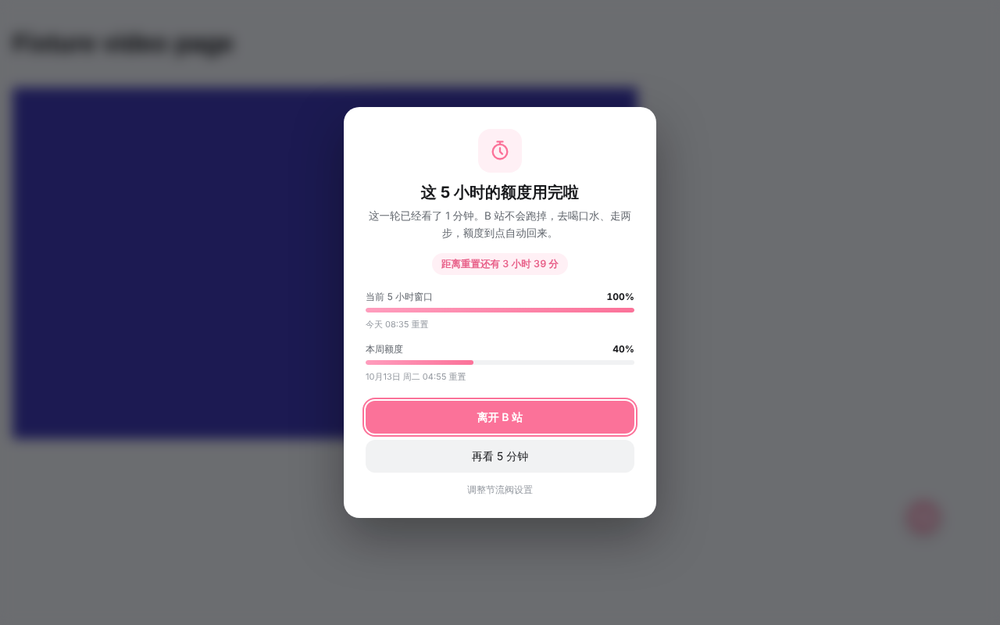
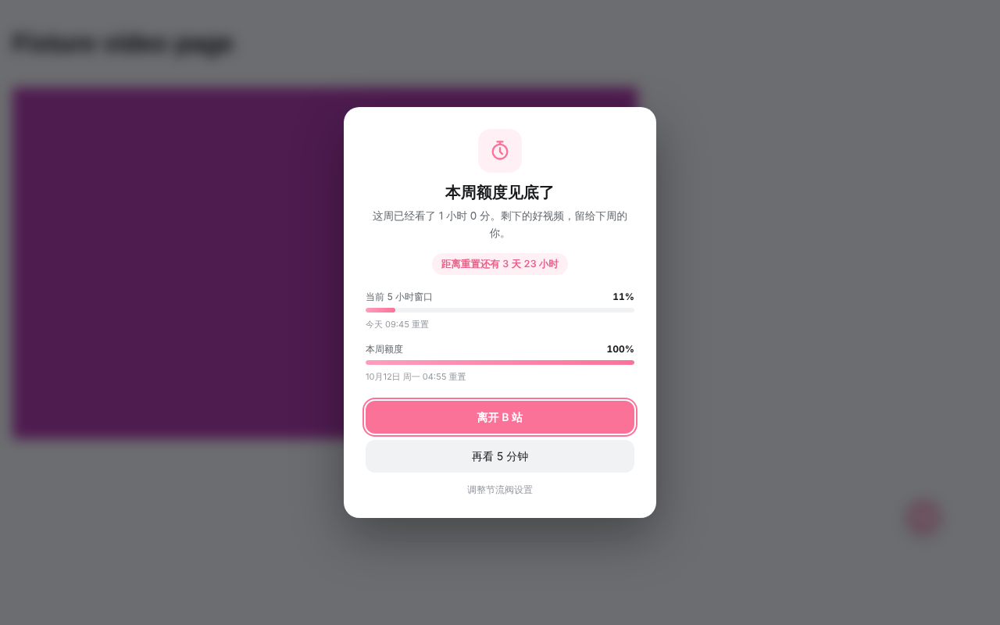
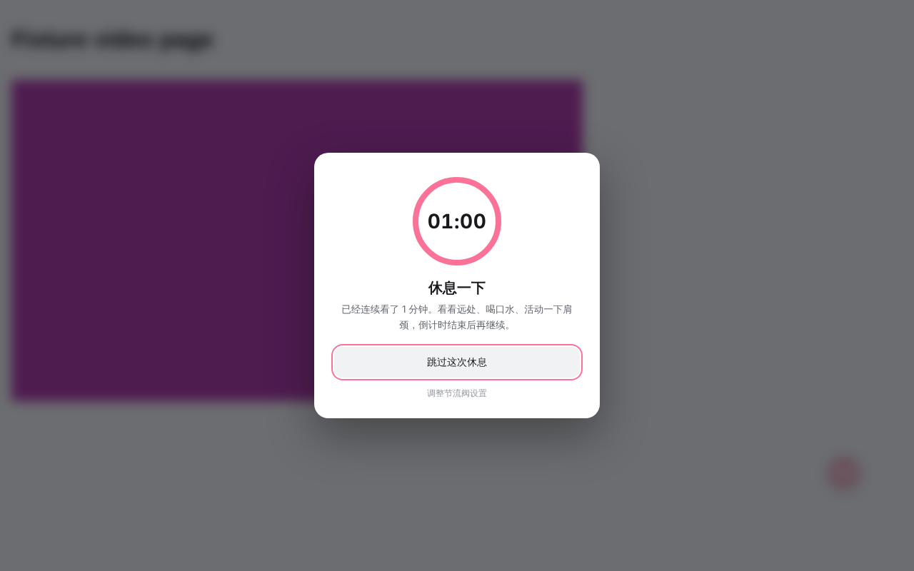
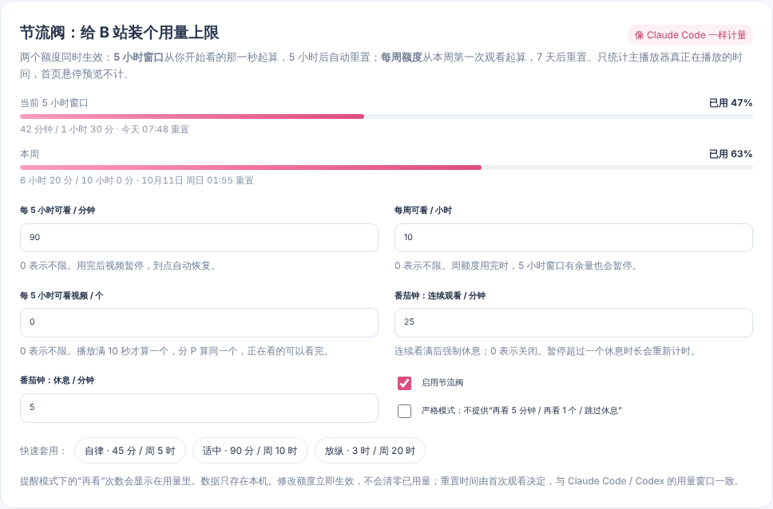
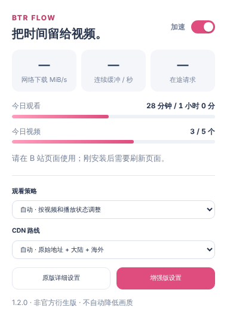
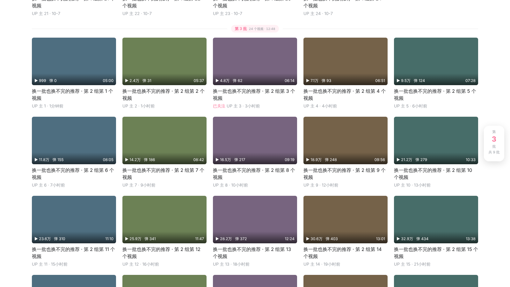

<div align="center">


# 哔哩节流阀 · BiliThrottle

**油门帮你踩，刹车也帮你踩。**

*Throttle* 既是「油门」也是「节流」：视频加载给你一脚油门；刷 B 站停不下来时，像 Claude Code 的用量额度一样给你一脚刹车。

[](https://github.com/ooooooomygosh/Better-Bilibili/releases/latest)
[](https://github.com/ooooooomygosh/Better-Bilibili/actions/workflows/ci.yml)


[](LICENSE)

[**⬇ 下载最新版**](https://github.com/ooooooomygosh/Better-Bilibili/releases/latest) · [安装](#安装) · [节流阀额度](#刹车节流阀额度) · [全部功能](#油门与其他功能) · [审计报告](docs/AUDIT-2026-10.zh-CN.md) · [更新日志](extension/CHANGELOG.md)



</div>

---

## 刹车：节流阀额度

用过 Claude Code 或 Codex 的人对这套规则不会陌生：

| 额度 | 怎么计时 | 默认 |
|---|---|---|
| **5 小时窗口** | 从你开始看的那一秒起算，5 小时后自动重置 | 每窗口 90 分钟 |
| **每周额度** | 从本周第一次观看起算，7 天后重置 | 每周 10 小时 |
| **每窗口视频数**（可选） | 播放满 10 秒算 1 个，分 P 算同一个，正在看的可以看完 | 不限 |
| **番茄钟**（可选） | 连续看满 N 分钟强制休息 M 分钟，带圆环倒计时 | 25 + 5 分钟 |

- 额度用完时主播放器暂停、退出全屏，遮罩上显示 **已用 %**、**重置时间**（「今天 15:20 重置」）和 **距离重置的倒计时**；到点后自动解除，不用刷新。
- **提醒模式**可以「再看 5 分钟 / 再看 1 个 / 跳过休息」，次数会记在用量里，随窗口一起清零；**严格模式**不给这些按钮。
- 只统计主播放器真实播放的时间，首页悬停预览不算；多个标签页由后台统一计数；数据只存在本机。
- 默认关闭。到 **扩展图标 → 增强版设置 → 节流阀** 里打开，有「自律 / 适中 / 放纵」三档预设。

<table>
<tr>
<td width="50%"></td>
<td width="50%"></td>
</tr>
<tr>
<td></td>
<td align="center"></td>
</tr>
</table>

## 油门与其他功能

| | 功能 | 说明 |
|---|---|---|
| ⚡ | **视频加载加速** | 多 CDN / Range 并发下载、自动线程数、按时长 / 码率 / 倍速调整缓冲；播放出问题可切到「兼容模式」，只保留 Range 加速。 |
| 🧹 | **首页净化** | 移除大图活动轮播和它留下的空位，隐藏带明确广告标记的卡片；季节横幅可以选择收起。不重排、不改动原生卡片。 |
| ♾️ | **无限下滑**（2.1 新增） | 开启后快到底时自动并发加载 1–3 批推荐（每批 12 / 24 / 30 个），按「第 N 批」接在下面，右侧显示当前第几批；去重、过滤广告，遇到限流自动暂停。默认关闭。 |
| ↩️ | **换一批可回看** | 推荐区上方的操作行：上一批 · 批次 · 下一批 · 换一批。历史只存在本机，每个标签页最多 25 批。 |
| 🌑 | **OLED 纯黑** | 仅在 B 站原生深色模式下，把首页主要底色改为 `#000`；不反色，不动封面和视频。 |
| 🌐 | **可选代理分流** | 默认关闭；明确授权后，只让 B 站域名走你自己的代理。 |
| 🎛️ | **页内面板** | 视频页右下角的「节流」按钮：CDN 路线、播放内核、线程数、诊断复制。 |

<p align="center"></p>

## 安装

> 还没上架应用商店，需要用「开发者模式」加载。

1. 到 [Releases](https://github.com/ooooooomygosh/Better-Bilibili/releases/latest) 下载 `BiliThrottle-x.y.z.zip` 并解压。
2. 打开 `chrome://extensions/`（Edge 是 `edge://extensions/`），打开右上角的 **开发者模式**。
3. 点击 **加载已解压的扩展程序**，选中直接包含 `manifest.json` 的 `BiliThrottle-x.y.z` 文件夹。
4. 刷新已经打开的 B 站标签页。

**从 BTR Flow 1.x 或旧版本升级**：先不要卸载。把新文件夹里的所有文件覆盖到原来加载的目录，在扩展页点「重新加载」，再刷新 B 站标签页。内部存储键没有变，设置和历史都会保留。

> [!IMPORTANT]
> 不要同时启用另一份线程撕裂者扩展或它的用户脚本，两套播放器拦截会冲突。本扩展不会自动更新，新版本请关注 Releases。

## 出问题怎么办

- **黑屏或画质菜单异常**：增强版设置 → 播放内核切到「兼容模式」后刷新页面；还不行就关闭视频加速。
- **首页异常**：关闭「启用首页净化与操作栏」，首页就会恢复原生布局。
- **节流阀误拦**：关闭「启用节流阀」立即解除，并欢迎[提交反馈](https://github.com/ooooooomygosh/Better-Bilibili/issues/new/choose)。
- **回退**：把旧版本的文件覆盖回原目录，然后重新加载扩展。

## 仓库结构

```
extension/          可以直接「加载已解压」的扩展本体（manifest.json 在这里）
  src/              内容脚本、后台 Service Worker、节流阀核心逻辑（focus-core.js）
  ui/               弹窗与设置页
  tests/            Node 单元测试与 Chromium 回归脚本
  docs/             隐私说明、上游同步、测试报告
docs/               审计报告、发布说明、截图
scripts/build.sh    打包为 dist/BiliThrottle-<版本>.zip
.github/workflows/  CI 测试；manifest 版本号变化时自动发布 Release
```

### 开发

```bash
node --test extension/tests/core.test.cjs extension/tests/update.test.cjs extension/tests/focus.test.cjs extension/tests/feed.test.cjs
./scripts/build.sh   # 生成 dist/BiliThrottle-<版本>.zip
# 修改 extension/manifest.json 的 version 并推送到 main，即自动构建并发布对应 Release
```

## 隐私

必需权限只有 `storage`。推荐历史和节流阀用量都只保存在本机，不上传任何数据；开启「无限下滑」后，扩展会以你的登录状态请求 B 站自己的首页推荐接口；代理权限只在你明确授权后才申请。详见[隐私说明](extension/docs/PRIVACY.zh-CN.md)。

## 致谢与许可

基于 [MrTangLuyao/Bilibili-thread-ripper](https://github.com/MrTangLuyao/Bilibili-thread-ripper)（线程撕裂者）的非官方 MV3 衍生版，原名 BTR Flow，已回移上游 2026.10.4.1 的适用修复。MIT 许可，保留原作者的版权声明。本项目与哔哩哔哩官方无关，与 Anthropic、OpenAI 也无关，只是借用了 Claude Code / Codex 的计量思路。
