<div align="center">

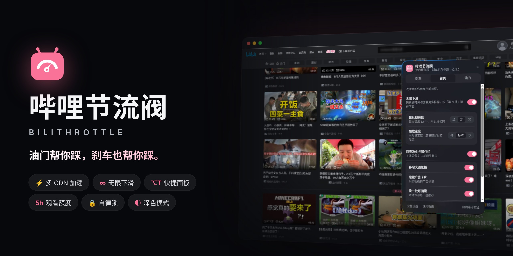

<h1>哔哩节流阀 · BiliThrottle</h1>

<p><b>B 站的油门和刹车。</b><br>想刷的时候，一路顺滑刷不到头；想停的时候，有人帮你踩刹车。</p>

<p>
<a href="https://github.com/ooooooomygosh/Better-Bilibili/releases/latest"></a>
</p>
<p>
<a href="https://github.com/ooooooomygosh/Better-Bilibili/actions/workflows/ci.yml"></a>


<a href="LICENSE"></a>
</p>

<p>
<a href="#modes">🔀 两种模式</a> ·
<a href="#filter">🚫 屏蔽</a> ·
<a href="#clean">🧽 全站净化</a> ·
<a href="#quick">🎛️ 快捷面板</a> ·
<a href="#limit">⏱️ 观看额度</a> ·
<a href="#lock">🔒 自律锁</a> ·
<a href="#speed">⚡ 加载加速</a> ·
<a href="#install">📦 安装</a> ·
<a href="#english">English</a>
</p>

<!-- 宣传片：B 站发布后取消下一行注释并填入 BV 号（GitHub 不能内嵌播放器，用封面图 + 链接） -->
<!-- <a href="https://www.bilibili.com/video/BV________">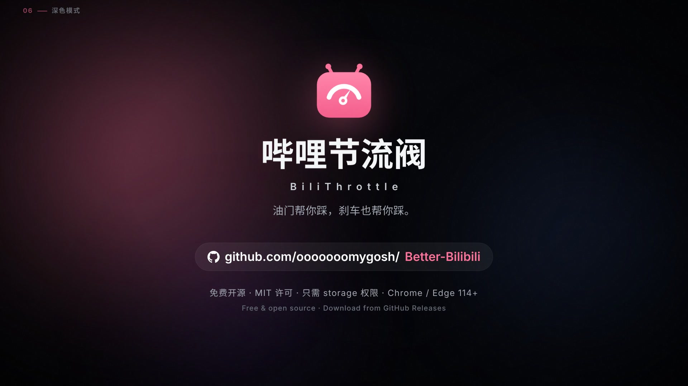</a> -->

</div>

---

## ✨ 一眼看懂

<table>
<tr>
<td width="50%" valign="top">
<br>
<b>♾️ 无限下滑</b><br>
推荐一批接一批往下接，往上翻都还在；用的是 B 站原生卡片。
</td>
<td width="50%" valign="top">
<br>
<b>🎞️ 原生卡片</b><br>
悬停逐帧预览、稍后再看、不感兴趣，和 B 站自己的卡片一模一样。
</td>
</tr>
<tr>
<td width="50%" valign="top">
<br>
<b>🎛️ 快捷面板</b><br>
右下角一个按钮，或者 <kbd>Alt</kbd>+<kbd>T</kbd>，常用开关都在这里。
</td>
<td width="50%" valign="top">
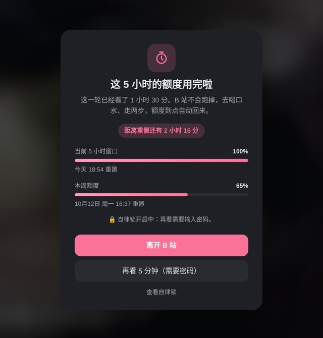<br>
<b>⏱️ 观看额度 + 🔒 自律锁</b><br>
5 小时窗口 + 每周额度。锁上以后，放宽要等冷却期或输入密码。
</td>
</tr>
</table>

> [!NOTE]
> **🆕 2.4.0 更新了什么**
> - 🔀 **两种首页模式，第一次打开先选**：「换一批」和「无限下滑」各走各的，不再混在一起；随时可以换。
> - 🚫 **屏蔽关键词 / UP 主 / B 站标签**：每次刷新都先过滤再去重，被屏蔽的永远不会占位；支持 `/正则/`，设置跟着 B 站账号所在的浏览器同步。
> - 🧽 **全站净化开关**：首页轮播广告、直播卡片、楼层推广，视频页广告和直播小窗，搜索 / 动态里的广告，「检测到广告拦截」提示……每一项都能单独开关。
> - 🛡️ **能和 AdGuard 一起用**：实测加载 AdGuard 的过滤规则后两者互不干扰；同时开启时，B 站可能会提示「检测到广告拦截」，在「净化」里关掉它即可。
>
> 完整记录见 [CHANGELOG](extension/CHANGELOG.md)。

<a id="modes"></a>

## 🔀 两种首页模式，各有各的最佳体验

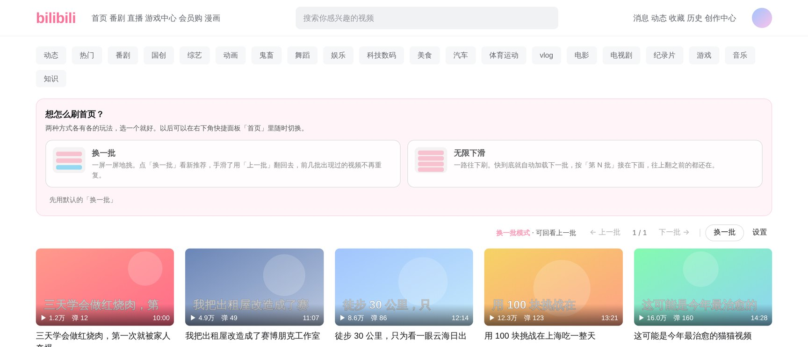

第一次打开 B 站首页时，推荐区上方会让你选一次（之后在快捷面板「首页」或设置页随时换）：

| | 🔄 换一批 | ♾️ 无限下滑 |
|---|---|---|
| 适合 | 想一屏一屏挑着看 | 想一口气刷下去 |
| 操作 | 推荐区上方 **← 上一批 · 3/5 · 下一批 → · 换一批** | 只管往下滑，没有任何「换一换」按钮 |
| 回看 | 「上一批」翻回去，每批都存着 | 往上翻，之前的都还在 |
| 屏蔽与去重 | 每批先过滤再补齐，换出来的都是没看过的 | 每一批拼接前过滤、跨批去重 |
| 计数 | 操作行里显示「已屏蔽 N」 | 分隔条和右侧计数显示「已屏蔽 N」 |

两种模式互不干扰：无限下滑时 B 站原生的「换一换」会被收起；换一批模式下也不会偷偷往下加载。

<a id="infinite"></a>

## ♾️ 无限下滑：一口气刷到底，一条都不会错过


B 站的「换一换」**每次只换两行**，点一下，上一批就没了；刷快了还得盯着转圈等加载。

打开无限下滑之后，首页会变成一条**刷不到头的推荐流**：

- 🚀 **预加载，不用等**。还没滑到底，下一批已经在路上。
- 📚 **每一批都拼在下面，往上翻还在**。新内容只往下接，不会替换之前的。
- 🔖 **第几批一目了然**。每批有「第 N 批 · 25 个视频 · 13:57」分隔条，右侧悬浮计数，点一下回到这一批开头。每批数量会按网格列数取整，最后一行不会缺位。
- 🎞️ **和原生卡片一模一样**。悬停预览画面、一键「稍后再看」、「⋮」菜单里的「不感兴趣 / 不想看此 UP 主」都有（只在本插件里隐藏，可撤销）；滑进屏幕时才轻轻淡入，加载时先显示骨架。
- 🧽 **干净**。自动去重，去掉广告；直播卡片和你屏蔽的内容拼接前就过滤掉，不会出现了再消失。
- 🛡️ **懂得收手**。请求方式与 B 站网页一致。一旦被限流立刻停下，用人话告诉你发生了什么，可以「重试」或一键切到「稳」。

<table>
<tr>
<td width="50%"></td>
<td width="50%"></td>
</tr>
<tr>
<td align="center"><sub>悬停逐帧预览（<a href="docs/media/hover-preview.mp4">MP4</a>）</sub></td>
<td align="center"><sub>⋮ → 不感兴趣 → 可撤销（<a href="docs/media/not-interested.mp4">MP4</a>）</sub></td>
</tr>
</table>

<a id="filter"></a>

## 🚫 屏蔽：不想看的，一次都别出现

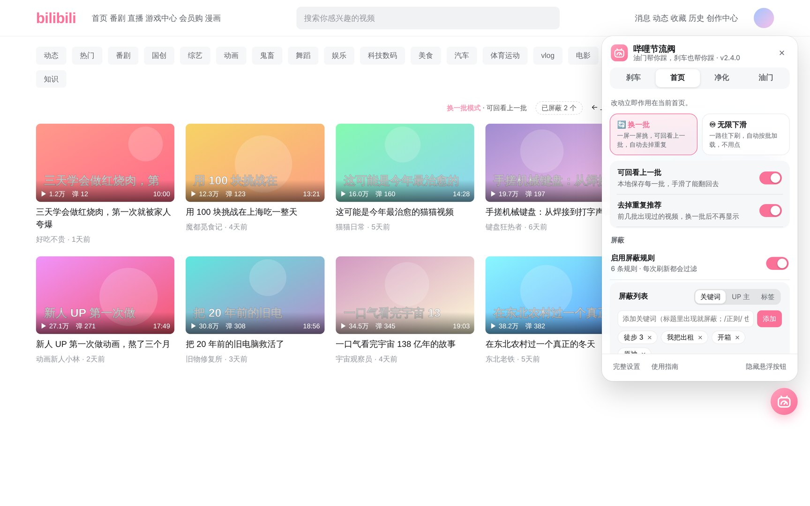

| 屏蔽什么 | 怎么加 | 说明 |
|---|---|---|
| **标题关键词** | 快捷面板「首页」或设置页输入 | 不区分大小写和全半角；写成 `/抽奖|开箱/` 就是正则 |
| **UP 主** | 卡片「⋮」→「不想看此 UP 主」，或手动输入名字 / UID | 按 UID 屏蔽，UP 主改名也跑不掉 |
| **B 站标签** | 卡片「⋮」→「按标签屏蔽…」，或手动输入 | 读取视频自己的标签（带缓存、限速），只在你加了标签规则时才会请求 |

- 每次刷新（换一批或拼接新的一批）都**先过滤、再去重**，再按列数补齐，最后一行不会缺位。
- 列表可以导出 / 导入 JSON，方便在几台电脑之间同步或分享给朋友；一键清空也有。
- 只在本插件里隐藏，**不会**向 B 站发送「不感兴趣」，不影响你账号的推荐。

<a id="clean"></a>

## 🧽 全站净化：B 站各处烦人的东西，一项一项关

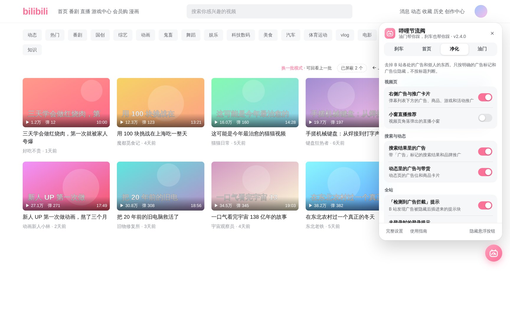

参考 AdGuard / uBlock 过滤规则的思路，用纯 CSS 在页面开始渲染前就隐藏，不会先闪一下再消失；只对当前页面用得上的规则生效。

| 页面 | 可以关掉的 |
|---|---|
| 首页 | 轮播图里的广告、直播卡片与直播楼层、番剧 / 影视 / 课堂等楼层推广 |
| 视频页 | 右侧广告与推广卡片（商品、游戏、活动）、小窗直播推荐 |
| 搜索与动态 | 带「广告」标记的搜索结果、动态里的广告位与带货卡片 |
| 全站 | 「检测到广告拦截」提示、未登录时反复弹出的登录浮层、「打开 App」引导、顶栏「下载客户端」入口 |

默认只打开明确的广告类；直播、楼层、登录提示这些「看个人喜好」的默认关闭。

<a id="quick"></a>

## 🪂 空降助手：恰饭片段，自动跳过

整合自 [BilibiliSponsorBlock](https://github.com/hanydd/BilibiliSponsorBlock)（B 站版 SponsorBlock），只装哔哩节流阀一个扩展就能用：

- 赞助/恰饭、自我推广、三连提醒、片头、片尾、回顾、离题闲聊、非音乐部分等 11 个分类，每类可设 **自动跳过 / 手动跳过 / 仅标记 / 关闭**。
- 进度条上按分类颜色标出片段；自动跳过后弹出提示，**一键撤销**回到片段开头；手动跳过的片段出现时点「跳过」或按 <kbd>Enter</kbd>。
- 精彩时刻提示「跳过去」；“静音”类片段播放时自动静音。
- 按 <kbd>;</kbd> 标记开始和结束，选分类后提交给社区。
- 弹窗和快捷面板「油门」页都有一键开关，11 个分类在设置页调整，立即生效不用刷新；首次安装的欢迎页会问你要不要开。
- 提示、标记和对话框都用本扩展自己的界面样式，跟随 B 站深浅色。

## 🎛️ 快捷面板：常用开关，一个按钮全搞定

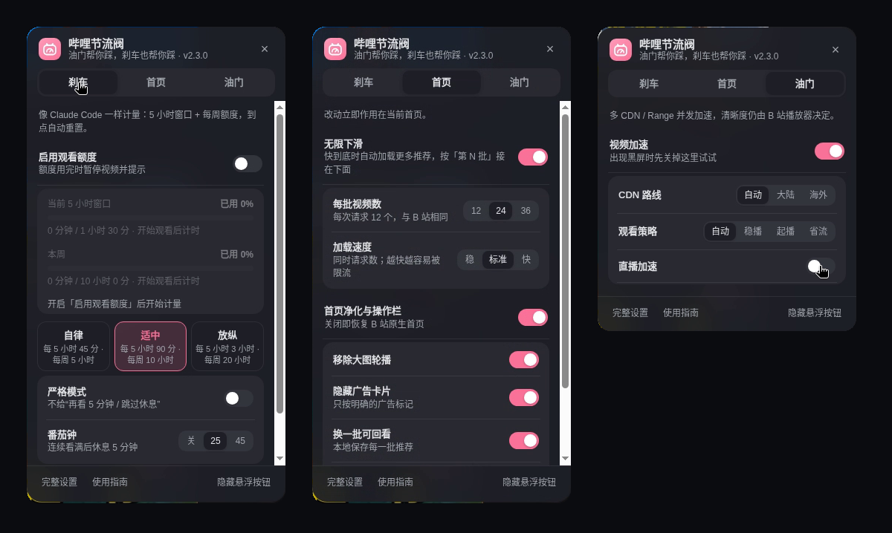

B 站每个页面的右下角都有一个粉色的油门按钮，点开（或按 <kbd>Alt</kbd>+<kbd>T</kbd>）就是全部常用开关。在输入框、弹幕框和评论框里按 <kbd>Alt</kbd>+<kbd>T</kbd> 不会误触发。

| 标签 | 能做什么 |
|---|---|
| **刹车** | 开关观看额度；5 小时 / 每周用量条；自律 · 适中 · 放纵三档预设；严格模式；番茄钟 |
| **首页** | 选模式（换一批 / 无限下滑）及各自的设置、屏蔽关键词 / UP 主 / 标签、去重、纯黑背景 |
| **净化** | 按页面分组的全站净化开关（首页、视频页、搜索与动态、全站） |
| **油门** | 视频加速、CDN 路线、观看策略、直播加速 |

- 自动打开当前页面用得上的那一页：首页打开「首页」，视频页打开「油门」。
- 屏蔽词输入框里打字不会触发 B 站自己的快捷键。
- 开启观看额度后，**按钮外圈就是一个进度环**，不用点开也知道这 5 小时看了多少。
- 按钮可以上下拖动；不想要也能隐藏，改从扩展图标打开。

<a id="limit"></a>

## ⏱️ 刹车：像 Claude Code 一样的观看额度

<table>
<tr>
<td width="56%" valign="top">

刷 B 站最怕的是「再看一个」。节流阀借用了 Claude Code / Codex 的用量规则：

| 额度 | 怎么计时 | 默认 |
|---|---|---|
| **5 小时窗口** | 从开始看的那一秒起算，5 小时后自动重置 | 90 分钟 |
| **每周额度** | 从本周第一次观看起算，7 天后重置 | 10 小时 |
| 每窗口视频数 | 播放满 10 秒算 1 个，正在看的可以看完 | 不限 |
| 番茄钟 | 连续看满 N 分钟，强制休息 M 分钟 | 25 + 5 |

- 额度用完时视频暂停，提示里写清楚**已用多少、几点重置、还要等多久**，到点自动解除。
- 只计算主播放器**真正在播放**的时间；首页悬停预览不算；多个标签页一起计数；数据只存本机。
- 默认关闭，在快捷面板「刹车」里一键开启。

</td>
<td width="44%" valign="top">
<br><br>
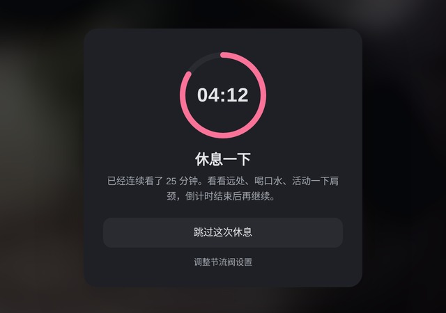
</td>
</tr>
</table>

<a id="lock"></a>

### 🔒 自律锁：防止自己随手放宽

额度设好了，下一秒自己又调回去？那等于没设。自律锁就是为这个准备的：

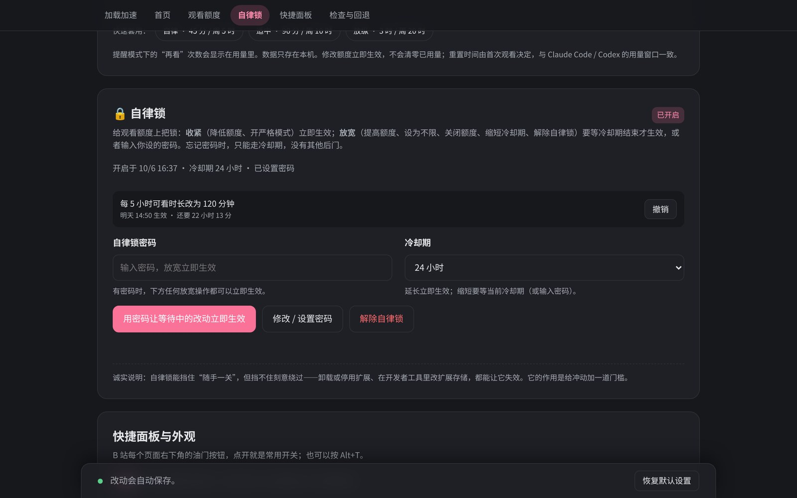

| 操作 | 锁住以后 |
|---|---|
| 收紧（降低额度、开启严格模式……） | **立即生效** |
| 放宽（调高额度、关闭额度、缩短冷却……） | 排队，**等冷却期过后**才生效（1 小时 – 7 天可选）；或**输入密码**立即生效 |
| 「再看 5 分钟」 | 需要密码 |
| 解除自律锁本身 | 同样算放宽：等冷却期或输入密码 |

- 密码可选，只保存加盐的 PBKDF2-SHA-256 哈希（21 万次迭代），不保存密码本身。**可以让朋友帮你设一个你不知道的密码。**
- 连续输错 5 次会暂时锁定输入（5 分钟起，逐次加倍）；忘了密码只能等冷却期，**没有后门**。
- 等待生效的放宽改动随时可以撤销。
- 这是给自己设的门槛，不是防破解：卸载扩展、用开发者工具改存储都能绕过。

<p align="center">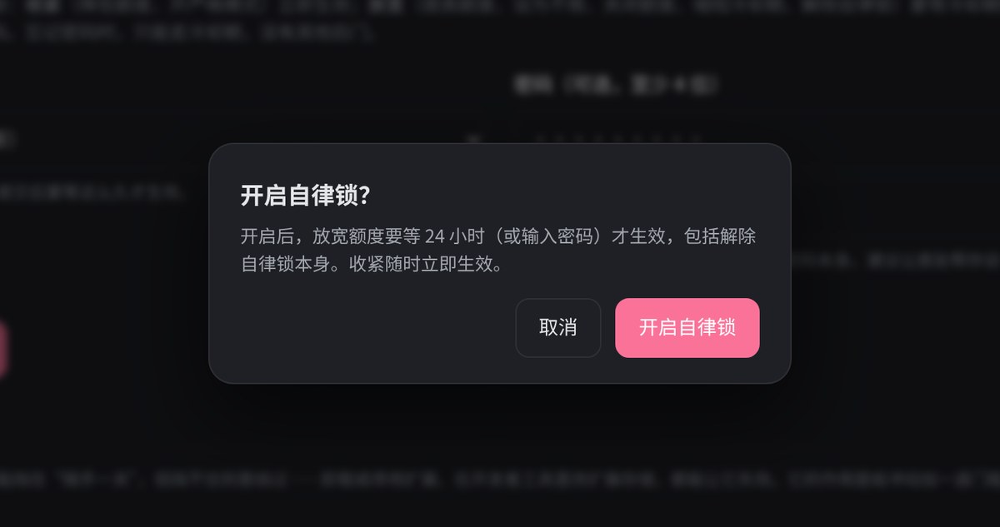</p>

<a id="home"></a>

## 🧹 首页净化 · 换一批可回看（「换一批」模式）


- **去掉大图活动轮播**，连同它占的格子一起收掉；隐藏带明确广告标记的卡片。
- 推荐区上方加一行 **← 上一批 · 2/2 · 下一批 → · 换一批**。每次「换一批」都会存一份，点快了还能翻回去。
- 不重排、不改写原生卡片；B 站深色模式下可以一键换成 **OLED 纯黑**。

<a id="speed"></a>

## ⚡ 油门：视频加载加速

<table>
<tr>
<td width="62%" valign="top">

继承自 [线程撕裂者](https://github.com/MrTangLuyao/Bilibili-thread-ripper) 的下载内核：**多 CDN 节点 + Range 分段并发**，按视频时长、码率、倍速和卡顿情况自动调整缓冲与线程数。

- 扩展图标弹窗里能实时看到下载速度、缓冲速度和在途请求数。
- 清晰度、字幕、弹幕仍由 B 站播放器决定，**不会悄悄给你降画质**。
- 播放出问题时，切到「兼容模式」或者关掉加速即可。

</td>
<td width="38%" valign="top">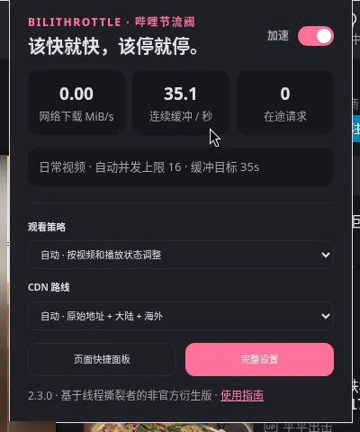</td>
</tr>
</table>

## 🌗 深色模式，跟着 B 站走

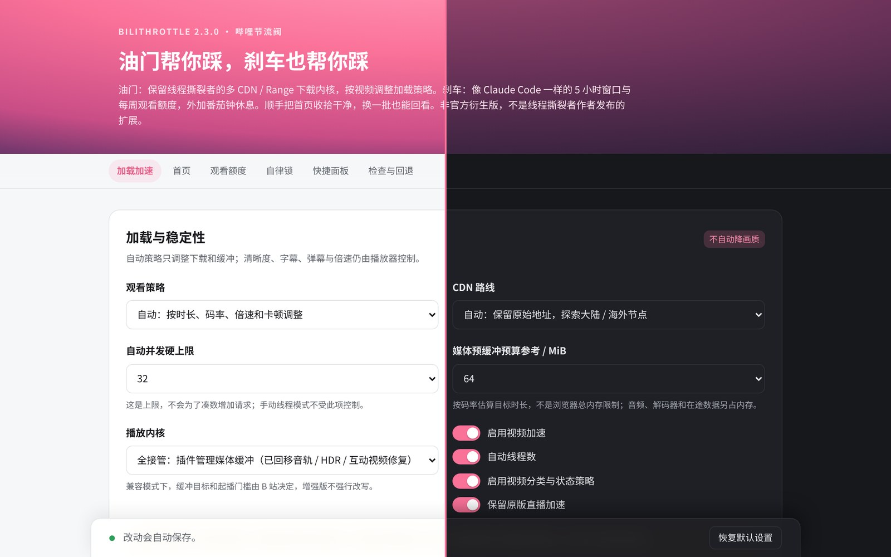

快捷面板、额度提醒、⋮ 菜单和无限下滑卡片都**实时跟随 B 站自己的主题**，切换后不用刷新。扩展弹窗、设置页和欢迎页可以在 设置 →「快捷面板与外观」→「扩展页面配色」里选 **跟随 B 站（默认）/ 跟随系统 / 浅色 / 深色**。

<p align="center">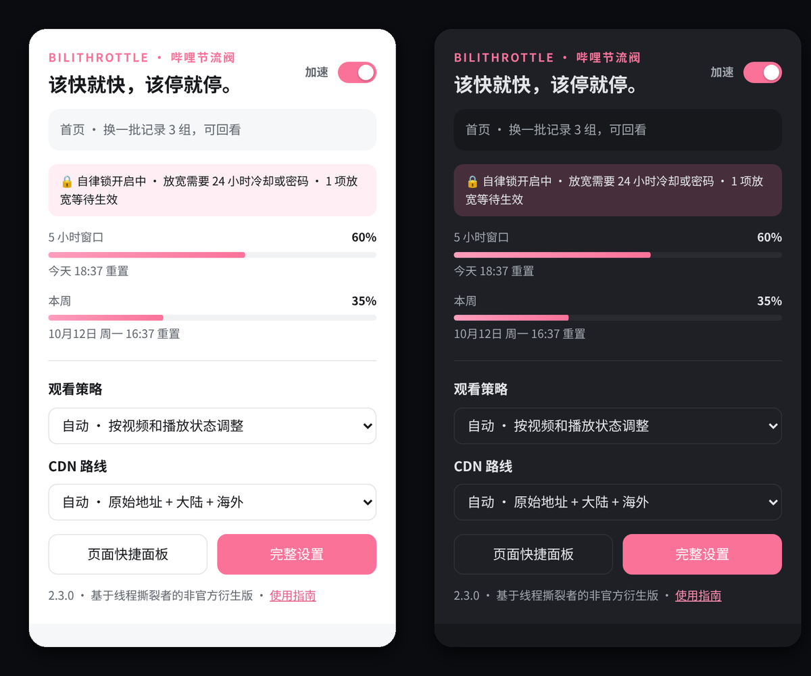</p>

## 🆚 装之前 / 装之后

| | B 站原生 | 装了节流阀 |
|---|---|---|
| 换一批 | 每次两行，旧的直接消失 | 无限下滑，一批批往下接，往上翻都还在 |
| 刷过头了 | 找不回来 | 「上一批」或者往上翻 |
| 首页 | 大轮播 + 广告 + 空白占位 | 只剩推荐 |
| 不想看的 | 一个个点「不感兴趣」 | 关键词 / UP 主 / 标签一次屏蔽，每次刷新都先过滤 |
| 各处广告 | 视频页、搜索、动态到处都是 | 全站净化，一项一项开关 |
| 停不下来 | 靠自觉 | 5 小时 / 每周额度 + 番茄钟 + 自律锁 |
| 设置 | — | 右下角一个按钮，四个标签页 |

<a id="install"></a>

## 📦 三步装好

> 暂未上架应用商店，需要以「开发者模式」加载，一分钟就够。

1. 到 [**Releases**](https://github.com/ooooooomygosh/Better-Bilibili/releases/latest) 下载 `BiliThrottle-x.y.z.zip` 并解压。
2. 打开 `chrome://extensions/`（Edge 是 `edge://extensions/`），打开右上角的 **开发者模式**。
3. 点 **加载已解压的扩展程序**，选择解压出来的 `BiliThrottle-x.y.z` 文件夹。

装好后会自动打开一页**使用指南**，可以在那里直接打开无限下滑、选一档观看额度。

<p align="center">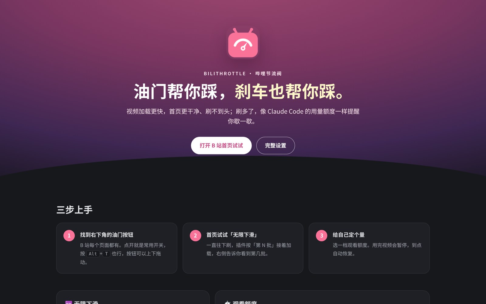</p>

<details>
<summary><b>从旧版本升级（BTR Flow 1.x / 节流阀 2.x）</b></summary>

先不要卸载。把新文件夹里的所有文件覆盖到原来加载的目录，在扩展页点「重新加载」，再刷新 B 站标签页。设置和历史都会保留。

</details>

## ❓ 常见问题

<details><summary><b>视频黑屏，或者画质菜单不对</b></summary>

网速很慢时，扩展接管后 **20 秒内一个媒体分段都没拿到**，会自动把视频交还给 B 站自己的播放器，并且这个视频不再自动接管；页面提示里有「重新接管」按钮，可以手动再试。

如果仍然有问题：快捷面板 →「油门」→ 关闭视频加速后刷新；或者在完整设置里把播放内核切到「兼容模式」。
</details>

<details><summary><b>无限下滑提示被限流</b></summary>

点提示里的「切到『稳』再试」，或者过几分钟点「重试」。插件被限流后会自己停下，不会一直请求。展开「详情」能看到 B 站返回的错误码，反馈问题时附上它就行。
</details>

<details><summary><b>开了自律锁，又想放宽怎么办？</b></summary>

放宽的改动会排队，冷却期过后自动生效；设了密码的话输入密码立即生效。忘了密码只能等冷却期，或者卸载重装扩展（会清空设置和用量记录）。
</details>

<details><summary><b>「不感兴趣」会影响我在 B 站的推荐吗？</b></summary>

不会。它只在本插件里隐藏这张卡片，记录存在本机，随时可以撤销。
</details>

<details><summary><b>首页看起来不对</b></summary>

快捷面板 →「首页」→ 关闭「首页净化与操作栏」，立刻恢复原生首页。
</details>

<details><summary><b>能和 AdGuard / uBlock Origin 一起用吗？</b></summary>

可以。我们加载了 AdGuard 的真实过滤规则（基础 + 中文过滤器 + 防烦扰）在 B 站首页、视频页、搜索页做了对照测试，两边隐藏的东西有重叠，但不会互相打架：节流阀的净化只加样式隐藏，不拦截请求、不删除元素。

可能遇到的情况：

- **B 站提示「检测到广告拦截」**：快捷面板 →「净化」→ 打开「『检测到广告拦截』提示」。
- **首页某块内容消失了，关掉节流阀也没回来**：那是 AdGuard 隐藏的，去 AdGuard 里给 bilibili.com 加白名单或关掉对应规则。
- **想只用一个**：在「净化」里把开关全关，节流阀就不再碰广告，交给 AdGuard 处理。
</details>

<details><summary><b>屏蔽了标签，为什么有的视频还是出现了一下？</b></summary>

关键词和 UP 主是立刻判断的；标签要先向 B 站查询这条视频的标签，查询失败（比如被限流）时为了不让推荐区空掉会先放行，下次刷新再查。频繁出现时可以改用关键词屏蔽。
</details>

<details><summary><b>能和线程撕裂者一起用吗？</b></summary>

不行。不要同时启用另一份线程撕裂者扩展或它的用户脚本，两套播放器拦截会互相冲突。
</details>

<details><summary><b>会自动更新吗？</b></summary>

不会。新版本发布在 [Releases](https://github.com/ooooooomygosh/Better-Bilibili/releases)，可以点右上角 Watch → Custom → Releases 订阅。
</details>

## 🔒 隐私

- 必需权限只有 `storage`。推荐历史、观看用量、「不感兴趣」和自律锁都只存在本机；屏蔽列表存在浏览器自带的同步存储里（跟随你登录的浏览器账号）。不上传任何数据，没有统计上报。
- 只有在你添加了「标签」屏蔽规则时，扩展才会请求 B 站公开的视频标签接口，结果缓存在本机。
- 开启「无限下滑」后，扩展会以你的登录状态请求 B 站**自己的**首页推荐接口，和 B 站网页用的是同一组接口；扩展不保存 Cookie。只有你点「稍后再看」时，才会读取 `bili_jct` 这一个值作为 B 站要求的防跨站令牌（和 B 站网页的做法一样）。
- 空降助手查询片段时，只向 BilibiliSponsorBlock 服务器（bsbsb.top）发送 BV 号 SHA-256 哈希的**前 4 位**，服务器无法确定你在看哪个视频，也不发送 Cookie。首次提交片段时才在本机生成匿名 ID（不同步），只随提交发送。可在弹窗里一键关闭。
- 详见[隐私说明](extension/docs/PRIVACY.zh-CN.md)。

## 🛠️ 开发

```
extension/          可直接「加载已解压」的扩展本体（manifest.json 在这里）
  src/              内容脚本与后台：quick-panel / home-infinite / feed-core / filter-core / clean-core / focus-core / lock-core / ui-kit …
  ui/               弹窗、设置页、欢迎页
  tests/            Node 单元测试 + Chromium 回归测试
docs/               审计报告、发布说明、截图
scripts/build.sh    打包为 dist/BiliThrottle-<版本>.zip
```

```bash
node --test extension/tests/*.test.cjs                                   # 单元测试
CHROMIUM_PATH=/path/to/chrome python3 extension/tests/browser-quick.py   # 任一浏览器回归测试
./scripts/build.sh                                                       # 打包
```

修改 `extension/manifest.json` 的版本号并推送到 main，GitHub Actions 会自动打包并发布对应的 Release。更新日志见 [CHANGELOG](extension/CHANGELOG.md)，审计记录见 [docs/AUDIT-2026-10.zh-CN.md](docs/AUDIT-2026-10.zh-CN.md)。

---

<a id="english"></a>

## 🌏 English

**BiliThrottle is a throttle *and* a brake for Bilibili.** It makes browsing faster and smoother — and helps you stop when you mean to.

| | Feature |
|---|---|
| ♾️ **Infinite native feed** | The homepage becomes an endless feed: batches append below (scroll back anytime), with batch dividers and a side counter. Appended cards are Bilibili's own cards — hover frame preview, Watch Later, and a "⋮" menu with *Not interested* (local only, undoable). |
| 🔀 **Two homepage modes** | Chosen on first visit: *Refresh* (Previous · Next · Refresh, every batch kept) or *Infinite* (just scroll, no refresh buttons). Each mode has its own controls and never interferes with the other. |
| 🚫 **Block lists** | Hide videos by title keyword (plain or `/regex/`), uploader (by UID) or Bilibili tag. Every refresh is filtered and de-duplicated before it is shown. Import / export as JSON. |
| 🧽 **Site-wide cleanup** | Per-item switches for ads and nags across the homepage, video pages, search and dynamics — carousel ads, live cards, promo floors, "ad blocker detected" notices, login pop-ups, "open the app" prompts. Pure CSS, applied before first paint. |
| 🎛️ **Quick panel** | A pink button on every page (or <kbd>Alt</kbd>+<kbd>T</kbd>) with four tabs: **Brake**, **Home**, **Cleanup**, **Throttle**. Doesn't fire while you're typing. |
| ⏱️ **Viewing quota** | Metered like Claude Code: a rolling **5-hour window** plus a **weekly cap**, optional per-window video count and a Pomodoro timer. Only real playback of the main player counts; data stays on your device. |
| 🔒 **Self-discipline lock** | Once locked, *tightening* applies instantly, while *loosening* (raising limits, turning the quota off, removing the lock) waits out a cooldown of 1 hour – 7 days — or needs the password. Salted PBKDF2 hash only; no back door. Ask a friend to set a password you don't know. |
| 🧹 **Clean homepage** | Removes the banner carousel and explicit ad cards; adds *Previous · Next · Refresh* so every reshuffle can be revisited. Optional OLED black. |
| ⚡ **Faster loading** | Multi-CDN + parallel range requests (from [Bilibili-thread-ripper](https://github.com/MrTangLuyao/Bilibili-thread-ripper)), adaptive buffering. Video quality stays Bilibili's call. |
| 🌗 **Dark mode** | The panel, overlays and feed cards follow Bilibili's own theme live; popup, options and welcome pages can follow Bilibili, follow the system, or stay light / dark. |
| 🐢 **Slow-network guard** | If no media segment arrives within 20 s of taking over, playback is handed back to Bilibili's own player (with a *Take over again* button) instead of a long black screen. |

**New in 2.4.0:** a homepage mode chooser, keyword / uploader / tag block lists with de-duplication, and site-wide cleanup switches. Works alongside AdGuard and uBlock Origin (tested with AdGuard's real filter lists); if Bilibili shows an "ad blocker detected" notice, switch it off under *Cleanup*. See the [changelog](extension/CHANGELOG.md) (Chinese).

**Install:** download `BiliThrottle-x.y.z.zip` from [Releases](https://github.com/ooooooomygosh/Better-Bilibili/releases/latest), unzip, open `chrome://extensions` (or `edge://extensions`), enable *Developer mode*, click *Load unpacked* and pick the folder. Chrome / Edge 114+.

**Privacy:** the only required permission is `storage`. Everything (feed history, usage, lock) stays local; no analytics. The segment-skip feature (from BilibiliSponsorBlock) sends only a 4-char SHA-256 prefix of the video id to bsbsb.top. The infinite feed calls Bilibili's own recommendation API with your existing session; the extension never stores cookies.

## 🙏 致谢与许可 · Credits & License

基于 [MrTangLuyao/Bilibili-thread-ripper](https://github.com/MrTangLuyao/Bilibili-thread-ripper)（线程撕裂者）的非官方 MV3 衍生版，原名 BTR Flow，保留原作者 MIT 版权声明。

### 致谢

- **[hanydd/BilibiliSponsorBlock](https://github.com/hanydd/BilibiliSponsorBlock)**（空降助手）：本扩展的空降助手移植自该项目，片段数据来自它的社区和服务器。感谢 hanydd 和所有贡献、标注片段的朋友！
- **[ajayyy/SponsorBlock](https://github.com/ajayyy/SponsorBlock)**：BilibiliSponsorBlock 的原型，由 Ajay Ramachandran 创建。

### 许可

自 **2.5.0** 起本项目以 [GPL-3.0-or-later](LICENSE) 发布（因整合了 GPL-3.0 的 BilibiliSponsorBlock 代码）；**2.4.0 及以前的版本为 MIT**，已发布版本的授权不变。第三方版权与许可见 [THIRD_PARTY_NOTICES.md](THIRD_PARTY_NOTICES.md)。

本项目与哔哩哔哩官方无关；与 Anthropic、OpenAI 也无关，只是借用了 Claude Code / Codex 的计量思路。
Not affiliated with Bilibili, Anthropic or OpenAI.
