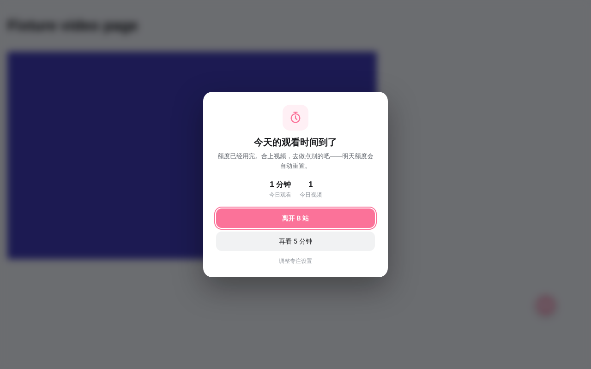

<div align="center">

# Better Bilibili · BTR Flow

**更快地加载，更干净的首页，更有节制地观看。**

一个 Chrome / Edge 浏览器扩展：保留 B 站原生播放器与推荐卡片，加速视频加载、净化首页，并用「专注模式」帮你给 B 站定个量。

[](https://github.com/ooooooomygosh/Better-Bilibili/releases/latest)
[](https://github.com/ooooooomygosh/Better-Bilibili/actions/workflows/ci.yml)


[](LICENSE)

[**⬇ 下载最新版**](https://github.com/ooooooomygosh/Better-Bilibili/releases/latest) · [安装](#安装) · [功能](#功能) · [专注模式](#专注模式番茄钟) · [审计报告](docs/AUDIT-2026-10.zh-CN.md) · [更新日志](extension/CHANGELOG.md)


</div>

---

## 功能

| | 功能 | 说明 |
|---|---|---|
| ⚡ | **视频加载加速** | 多 CDN / Range 并发下载、智能线程数、按时长/码率/倍速调整缓冲；可切换「兼容模式」只加速 Range。 |
| 🧹 | **首页净化** | 移除大图活动轮播及其网格占位，隐藏带明确广告标记的卡片；可选收起季节横幅。不重排、不改原生卡片。 |
| ↩️ | **换一批可回看** | 推荐区上方紧凑操作行：上一批 · 批次 · 下一批 · 换一批。历史只存本机，每标签页最多 25 批。 |
| ⏱️ | **专注模式（1.2.0 新增）** | 每日观看时长 / 视频个数上限 + 番茄钟强制休息，提醒或严格两种模式。 |
| 🌑 | **OLED 纯黑** | 仅在 B 站原生深色时，把首页主要底色改为 `#000`；不反色、不碰封面和视频。 |
| 🌐 | **可选代理分流** | 默认关闭；明确授权后仅 B 站域名走你自己的代理。 |

## 专注模式（番茄钟）

刷 B 站停不下来？在 **扩展图标 → 增强版设置 → 专注模式** 中打开：

- **每日观看时长**：例如 60 分钟，用完后视频暂停并提示。
- **每日视频个数**：例如 5 个；播放满 10 秒才算 1 个，分 P 算同一个，正在看的那个可以看完。
- **番茄钟**：连续看满 25 分钟强制休息 5 分钟（时长可调），带圆环倒计时；暂停超过一个休息时长会自动重新计时。
- **提醒模式 / 严格模式**：提醒模式可以「再看 5 分钟 / 再看 1 个 / 跳过休息」，次数计入统计；严格模式不给这些按钮。
- **每天几点重置**：0:00 / 4:00 / 6:00（默认 4:00，熬夜看的算前一天）。
- 只统计主播放器真实播放的时间，首页悬停预览不计；多个标签页由后台统一计数；数据只存本机。

<table>
<tr>
<td></td>
<td></td>
</tr>
<tr>
<td colspan="2"></td>
</tr>
</table>

## 安装

> 本扩展未上架应用商店，需要以「开发者模式」加载。

1. 到 [Releases](https://github.com/ooooooomygosh/Better-Bilibili/releases/latest) 下载 `BTR-Flow-x.y.z.zip` 并解压。
2. 打开 `chrome://extensions/`（Edge：`edge://extensions/`），开启右上角 **开发者模式**。
3. 点击 **加载已解压的扩展程序**，选择直接包含 `manifest.json` 的 `BTR-Flow-x.y.z` 文件夹。
4. 刷新已打开的 B 站标签页。

**从旧版本升级**：不要先卸载。把新文件夹里的全部文件覆盖到原来加载的目录，在扩展页点「重新加载」，再刷新 B 站标签页——这样能保留扩展 ID、设置和历史。

> [!IMPORTANT]
> 不要同时启用另一份线程撕裂者扩展或其用户脚本，播放器拦截器不能叠加。本扩展不会自动更新，请关注 Releases。

## 出问题怎么办

- **黑屏 / 画质菜单异常**：增强版设置 → 播放内核切到「兼容模式」并刷新；仍异常就关闭视频加速。
- **首页异常**：关闭「启用首页净化与操作栏」即可恢复原生布局。
- **专注模式误判**：关闭「启用专注模式」立即解除；欢迎附上页面类型[提交反馈](https://github.com/ooooooomygosh/Better-Bilibili/issues/new/choose)。
- 回退：把旧版本文件覆盖回原目录，重新加载扩展。

## 仓库结构

```
extension/          可直接「加载已解压」的扩展本体（manifest.json 在这里）
  src/              内容脚本、后台 Service Worker、专注模式核心
  ui/               弹窗与设置页
  tests/            Node 单元测试与 Chromium 回归脚本
  docs/             隐私说明、上游同步、测试报告
docs/               审计报告、发布说明、截图
scripts/build.sh    打包为 dist/BTR-Flow-<版本>.zip
.github/workflows/  CI 测试；推送 v* 标签自动发布 Release
```

### 开发

```bash
node --test extension/tests/core.test.cjs extension/tests/update.test.cjs extension/tests/focus.test.cjs
./scripts/build.sh                       # 生成 dist/BTR-Flow-<版本>.zip
git tag v1.2.0 && git push origin v1.2.0 # 自动构建并发布 Release
```

## 隐私

必需权限只有 `storage`。推荐历史与专注模式用量只保存在本机，不上传任何数据；代理权限仅在你明确授权后申请。详见 [隐私说明](extension/docs/PRIVACY.zh-CN.md)。

## 致谢与许可

基于 [MrTangLuyao/Bilibili-thread-ripper](https://github.com/MrTangLuyao/Bilibili-thread-ripper)（线程撕裂者）的非官方 MV3 维护分支，已回移上游 2026.10.4.1 的适用修复。MIT 许可，保留原作者版权声明。本项目与哔哩哔哩官方无关。
