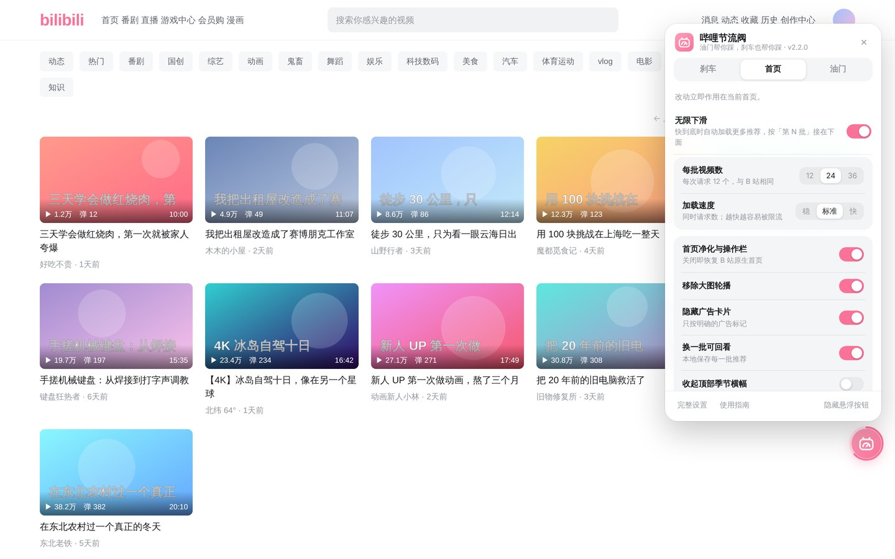
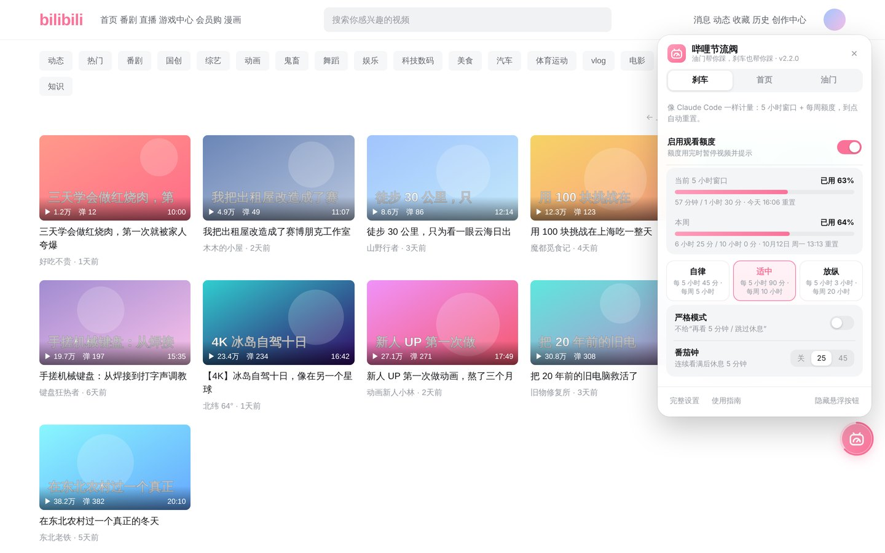
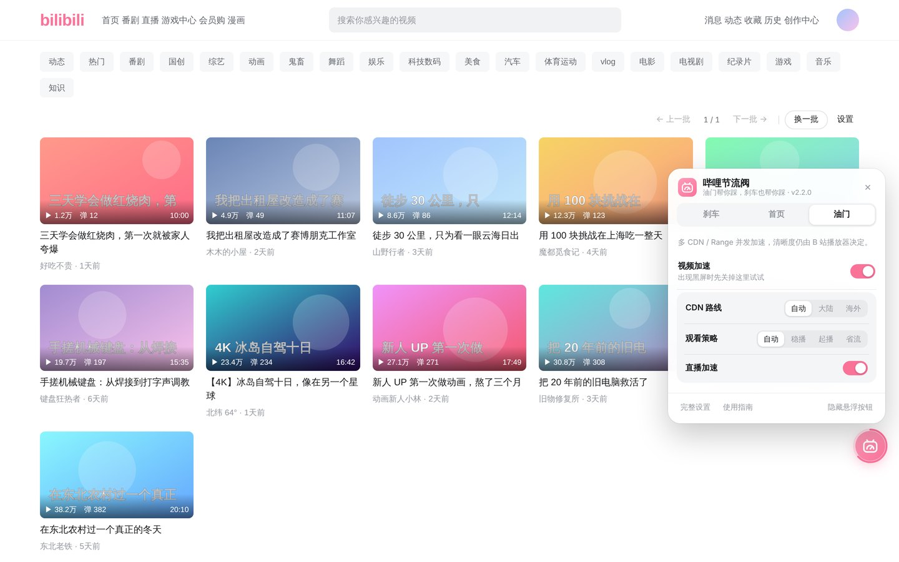
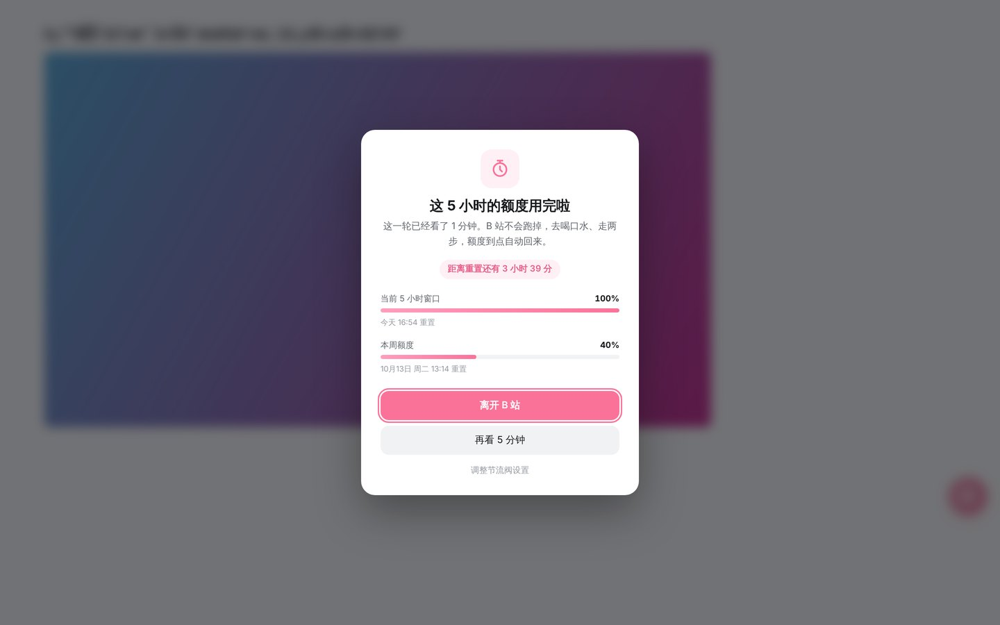
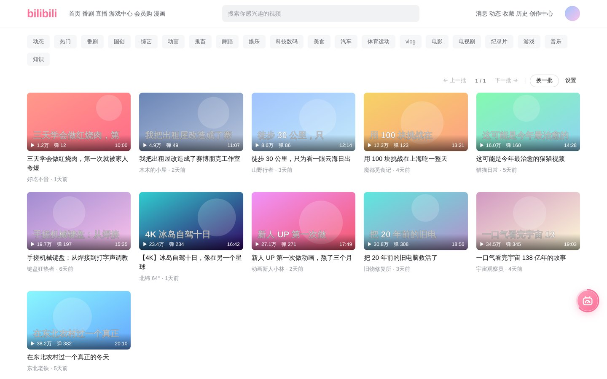
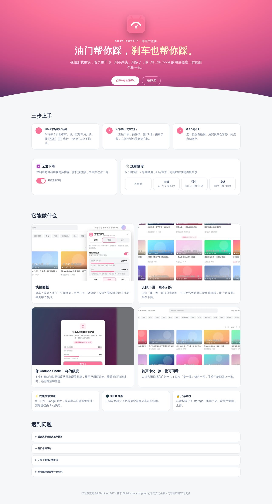

<div align="center">


# 哔哩节流阀 · BiliThrottle

**B 站的油门和刹车。** 想刷的时候一路刷不到头，想停的时候有人帮你踩刹车。

[](https://github.com/ooooooomygosh/Better-Bilibili/releases/latest)

[](https://github.com/ooooooomygosh/Better-Bilibili/actions/workflows/ci.yml)


[](LICENSE)

[♾️ 无限下滑](#infinite) · [🎛️ 快捷面板](#quick) · [⏱️ 观看额度](#limit) · [🧹 首页净化](#home) · [⚡ 加载加速](#speed) · [📦 安装](#install)

</div>

---

<a id="infinite"></a>

## ♾️ 无限下滑：一口气刷到底，一条都不会错过


B 站的「换一换」**每次只换两行**，点一下，上一批就没了；刷快了还得盯着转圈等它加载。

打开无限下滑之后，首页会变成一条**刷不到头的推荐流**：

- 🚀 **多线程预加载，不用等**。还没滑到底，下一批已经在路上，几路请求同时发出，滑到哪里内容就已经在哪里。
- 📚 **每一批都拼在下面，往上翻还在**。新内容只往下接，不会替换掉之前的。手滑刷过去了？往回翻就是。
- 🔖 **第几批一目了然**。每批有「第 N 批 · 24 个视频 · 12:47」分隔条，右侧悬浮提示你正在看第几批，点一下回到这一批开头。
- 🎞️ **和原生卡片一模一样**。加载出来的卡片用的就是 B 站自己的卡片样式：悬停预览画面、一键「稍后再看」、「不感兴趣 / 不想看此 UP 主」（只在本插件里隐藏，可撤销）都有；滑进屏幕时才轻轻淡入，加载时先显示骨架。
- 🧽 **干净**。自动去重，自动去掉广告和直播卡片；B 站留下的空白占位也会隐藏。
- 🛡️ **懂得收手**。请求方式与 B 站网页完全一致（每次 12 个）。一旦 B 站提示限流，立刻停下，用人话告诉你发生了什么，可以「重试」或一键切到「稳」。

每批 12 / 24 / 36 个视频、加载速度「稳 / 标准 / 快」都能在快捷面板里一键切换。

<br clear="right">

<a id="quick"></a>

## 🎛️ 快捷面板：常用开关，一个按钮全搞定



B 站每个页面的右下角，都有一个粉色的油门按钮（按 <kbd>Alt</kbd>+<kbd>T</kbd> 也行），点开就是全部常用开关：

| 标签 | 能做什么 |
|---|---|
| **刹车** | 开关观看额度；5 小时 / 每周用量条；自律 · 适中 · 放纵三档预设；严格模式；番茄钟 |
| **首页** | 无限下滑（每批数量、加载速度）、首页净化、移除轮播、隐藏广告、换一批回看、纯黑背景 |
| **油门** | 视频加速、CDN 路线、观看策略、直播加速；视频页可进入高级播放设置 |

- 自动打开当前页面用得上的那一页：在首页打开「首页」，在视频页打开「油门」。
- 开启观看额度后，**按钮外圈就是一个进度环**，不用点开也知道这 5 小时看了多少。
- 按钮可以上下拖动，挡住内容了就挪开；不想要也能隐藏，改从扩展图标打开。

<table>
<tr>
<td width="50%"></td>
<td width="50%"></td>
</tr>
</table>

<a id="limit"></a>

## ⏱️ 刹车：像 Claude Code 一样的观看额度



刷 B 站最怕的是「再看一个」。节流阀借用了 Claude Code / Codex 的用量规则：

| 额度 | 怎么计时 | 默认 |
|---|---|---|
| **5 小时窗口** | 从开始看的那一秒起算，5 小时后自动重置 | 90 分钟 |
| **每周额度** | 从本周第一次观看起算，7 天后重置 | 10 小时 |
| 每窗口视频数 | 播放满 10 秒算 1 个，正在看的可以看完 | 不限 |
| 番茄钟 | 连续看满 N 分钟，强制休息 M 分钟 | 25 + 5 |

- 额度用完时视频暂停，提示里写清楚**已用多少、几点重置、还要等多久**。到点自动解除，不用刷新页面。
- 提醒模式可以「再看 5 分钟」；严格模式不给这个按钮。
- 只计算主播放器**真正在播放**的时间，首页悬停预览不算；多个标签页一起计数；用量数据只保存在本机。
- 默认关闭，在快捷面板「刹车」里一键开启。

### 🔒 自律锁：防止自己随手放宽

在完整设置 →「自律锁」里开启：**收紧额度立即生效，放宽要等冷却期**（1 小时 – 7 天可选），或者输入密码立即生效。

- 密码可选，只保存加盐的 PBKDF2 哈希；可以让朋友帮你设一个你不知道的密码。忘了密码就只能等冷却期，没有后门。
- 锁开启时「再看 5 分钟」也需要密码。等待生效的放宽改动随时可以撤销。
- 这是给自己设的门槛，不是防破解：卸载扩展、用开发者工具改存储都能绕过。

<br clear="right">

<a id="home"></a>

## 🧹 首页净化 · 换一批可回看



- **去掉大图活动轮播**，连同它占的格子一起收掉；隐藏带明确广告标记的卡片。
- 推荐区上方加一行 **上一批 · 第几批 · 下一批 · 换一批**。每次「换一批」都会存一份，点快了还能翻回去。
- 不重排、不改写原生卡片，悬停预览、稍后再看都还在；B 站深色模式下可以一键换成 **OLED 纯黑**。

<a id="speed"></a>

## ⚡ 油门：视频加载加速

继承自 [线程撕裂者](https://github.com/MrTangLuyao/Bilibili-thread-ripper) 的下载内核：多 CDN 节点 + Range 分段并发，按视频时长、码率、倍速和卡顿情况自动调整缓冲与线程数。清晰度、字幕、弹幕仍由 B 站播放器决定，**不会悄悄给你降画质**。播放出问题时，切到「兼容模式」或者关掉加速即可。

## 🆚 装之前 / 装之后

| | B 站原生 | 装了节流阀 |
|---|---|---|
| 换一批 | 每次两行，旧的直接消失 | 多线程无限下滑，一批批往下接，往上翻都还在 |
| 刷过头了 | 找不回来 | 「上一批」或者往上翻 |
| 首页 | 大轮播 + 广告 + 空白占位 | 只剩推荐 |
| 停不下来 | 靠自觉 | 5 小时 / 每周额度 + 番茄钟 |
| 设置 | — | 右下角一个按钮，三个标签页 |

<a id="install"></a>

## 📦 三步装好

> 暂未上架应用商店，需要以「开发者模式」加载，一分钟就够。

1. 到 [**Releases**](https://github.com/ooooooomygosh/Better-Bilibili/releases/latest) 下载 `BiliThrottle-x.y.z.zip` 并解压。
2. 打开 `chrome://extensions/`（Edge 是 `edge://extensions/`），打开右上角的 **开发者模式**。
3. 点 **加载已解压的扩展程序**，选择解压出来的 `BiliThrottle-x.y.z` 文件夹。

装好后会自动打开一页**使用指南**，可以在那里直接打开无限下滑、选一档观看额度。

<details>
<summary><b>从旧版本升级（BTR Flow 1.x / 节流阀 2.x）</b></summary>

先不要卸载。把新文件夹里的所有文件覆盖到原来加载的目录，在扩展页点「重新加载」，再刷新 B 站标签页。设置和历史都会保留。

</details>

<p align="center"></p>

## ❓ 常见问题

<details><summary><b>视频黑屏，或者画质菜单不对</b></summary>

快捷面板 →「油门」→ 关闭视频加速后刷新；或者在完整设置里把播放内核切到「兼容模式」。
</details>

<details><summary><b>无限下滑提示被限流</b></summary>

点提示里的「切到『稳』再试」，或者过几分钟点「重试」。插件被限流后会自己停下，不会一直请求。展开「详情」能看到 B 站返回的错误码，反馈问题时附上它就行。
</details>

<details><summary><b>开了自律锁，又想放宽怎么办？</b></summary>

放宽的改动会排队，冷却期过后自动生效；设了密码的话输入密码立即生效。忘了密码只能等冷却期，或者卸载重装扩展（会清空设置和用量记录）。
</details>

<details><summary><b>首页看起来不对</b></summary>

快捷面板 →「首页」→ 关闭「首页净化与操作栏」，立刻恢复原生首页。
</details>

<details><summary><b>能和线程撕裂者一起用吗？</b></summary>

不行。不要同时启用另一份线程撕裂者扩展或它的用户脚本，两套播放器拦截会互相冲突。
</details>

<details><summary><b>会自动更新吗？</b></summary>

不会。新版本发布在 [Releases](https://github.com/ooooooomygosh/Better-Bilibili/releases)，可以点右上角 Watch → Custom → Releases 订阅。
</details>

## 🔒 隐私

- 必需权限只有 `storage`。推荐历史、观看用量只存在本机，不上传任何数据，也没有统计上报。
- 开启「无限下滑」后，扩展会以你的登录状态请求 B 站**自己的**首页推荐接口，和 B 站网页加载推荐用的是同一组接口；扩展不保存 Cookie。只有你点「稍后再看」时，会读取 `bili_jct` 这一个值作为 B 站要求的防跨站令牌（和 B 站网页的做法一样）。「不感兴趣」和自律锁都只存在本机。
- 不申请也不更改代理设置（2.3.0 移除了无法授权的「海外访问」代理分区）。详见[隐私说明](extension/docs/PRIVACY.zh-CN.md)。

## 🛠️ 开发

```
extension/          可直接「加载已解压」的扩展本体（manifest.json 在这里）
  src/              内容脚本与后台：quick-panel / home-infinite / feed-core / focus-core / lock-core / ui-kit …
  ui/               弹窗、设置页、欢迎页
  tests/            Node 单元测试 + Chromium 回归测试
docs/               审计报告、发布说明、截图
scripts/build.sh    打包为 dist/BiliThrottle-<版本>.zip
```

```bash
node --test extension/tests/{core,update,focus,feed,lock,sw-lock}.test.cjs  # 单元测试
CHROMIUM_PATH=/path/to/chrome python3 extension/tests/browser-quick.py   # 任一浏览器回归测试
./scripts/build.sh                                                       # 打包
```

修改 `extension/manifest.json` 的版本号并推送到 main，GitHub Actions 会自动打包并发布对应的 Release。更新日志见 [CHANGELOG](extension/CHANGELOG.md)，审计记录见 [docs/AUDIT-2026-10.zh-CN.md](docs/AUDIT-2026-10.zh-CN.md)。

## 🙏 致谢与许可

基于 [MrTangLuyao/Bilibili-thread-ripper](https://github.com/MrTangLuyao/Bilibili-thread-ripper)（线程撕裂者）的非官方 MV3 衍生版，原名 BTR Flow。MIT 许可，保留原作者版权声明。

本项目与哔哩哔哩官方无关；与 Anthropic、OpenAI 也无关，只是借用了 Claude Code / Codex 的计量思路。
